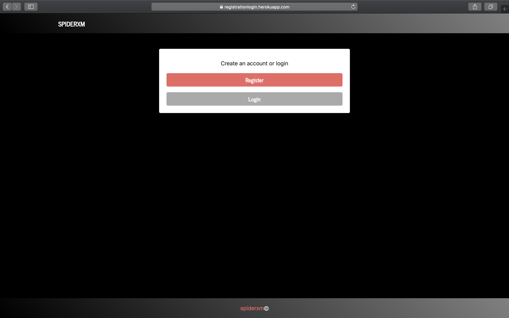
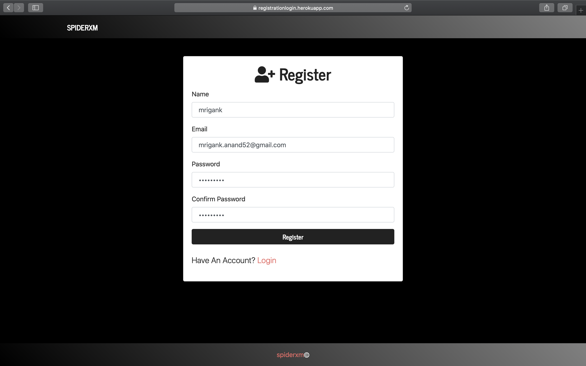
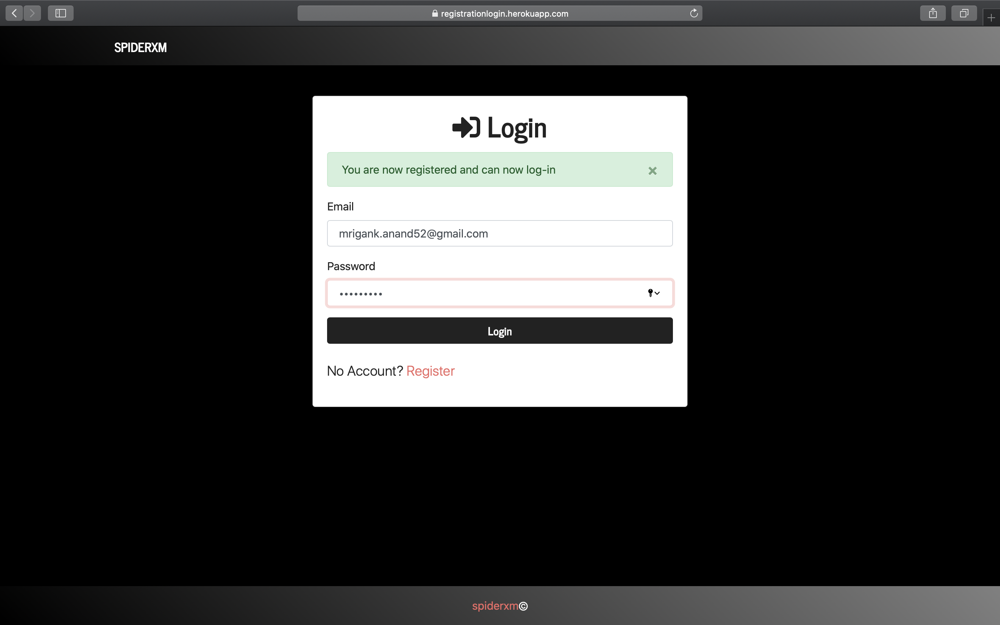
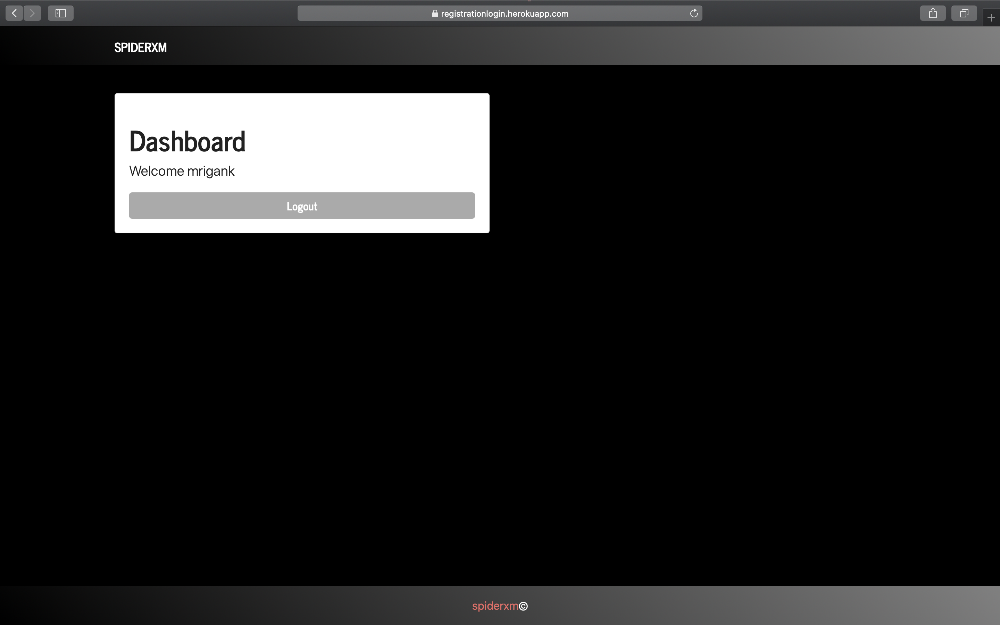
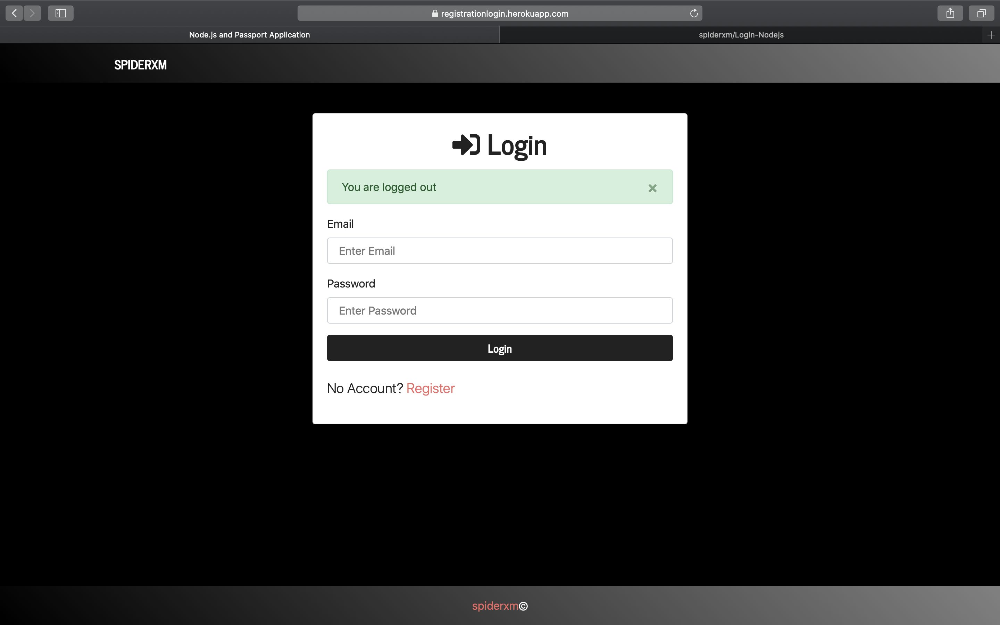

# Login and registration page build using node.js, mongodb, express, passport, session, flash.
This provides proper user authentication and registration with hashed passowords using bcrypt for user security.
Dashboard route can only be accessed on login.

 
 
 
 
 
